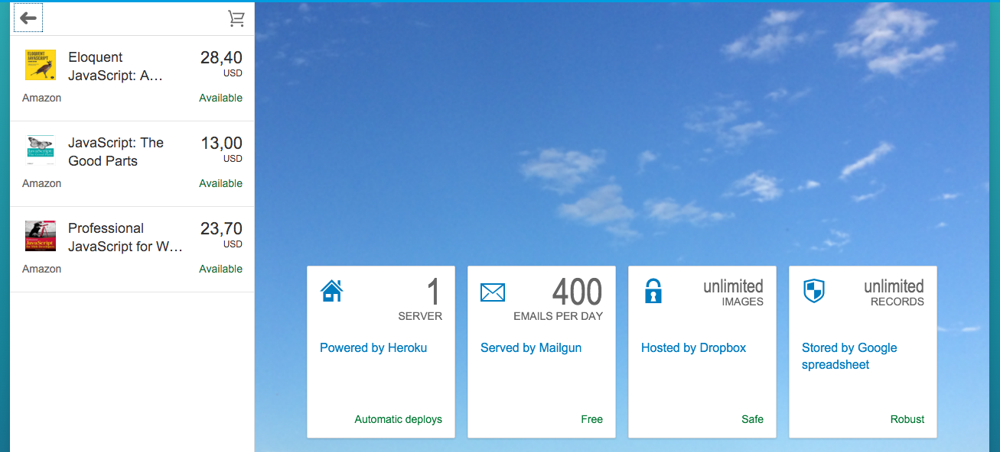

openui5-app-shopping-cart
=========================

# About This Project

This is one of my personal open source project built on top of the demo app comes with the sdk, a hassle-free shopping cart web application created for a senior friend of mine who runs a mamas & papas shop. This application was built with OpenUI5 framework that consumes the most robust and easy to maintain database - Google spreadsheet :) as its data source, hosted with Heroku, integrated with Mailgun. It's not really that impressive from a technical point of view, but I'm happy with it because once again, the code I wrote, the things I built made a small difference in someone's day.

# Getting Started

1. Replace the sSheetsUrl variable value (util/Util.js line 11) with your Google spreadsheet key, and check out this sample [sheet](https://docs.google.com/spreadsheets/d/10z6wM7OJjF0qxLaiWsGxlzsQ5L9RPW32IGPu7XH6abY/edit?usp=sharing) to create your own data source.
2. Replace Mailgun API key and address (app.rb line 23) with your own [Mailgun](https://documentation.mailgun.com/quickstart-sending.html#send-via-api) account API key and address.

# Deploying to Heroku

1. Download the Heroku Toolbelt.
2. Go to Heroku.com and register.
3. Issue "heroku login" to authenticate, with the credentials from previous step. Make sure it's a git repository, by issuing "git init", and also "git add", "git commit" your files.
4. Then "heroku create" to create this app on heroku. This command also adds a "heroku" remote repository that you can push to.
5. To deploy, issue "git push heroku master".
6. Other helpful heroku commands:
  - heroku logs
  - heroku logs -t
  - heroku rename
  - heroku restart
  - heroku run console
  - heroku help
